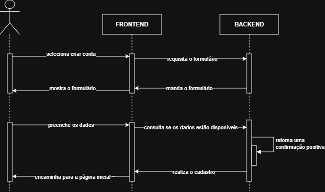
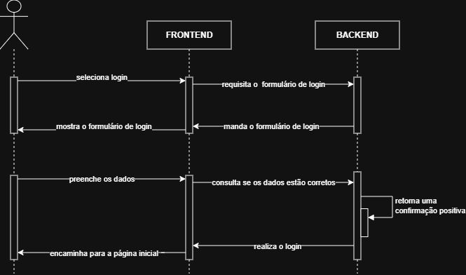
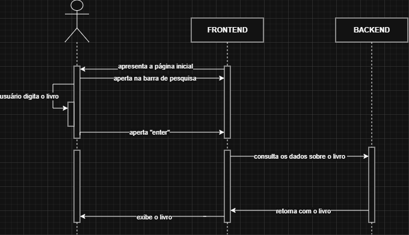
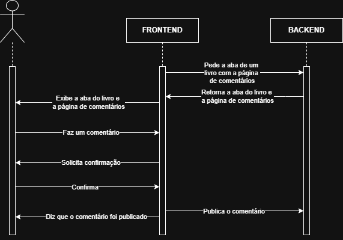
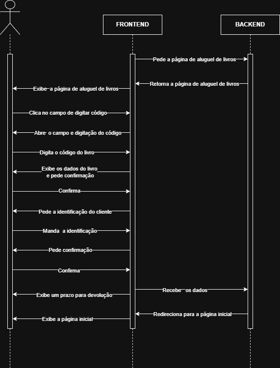
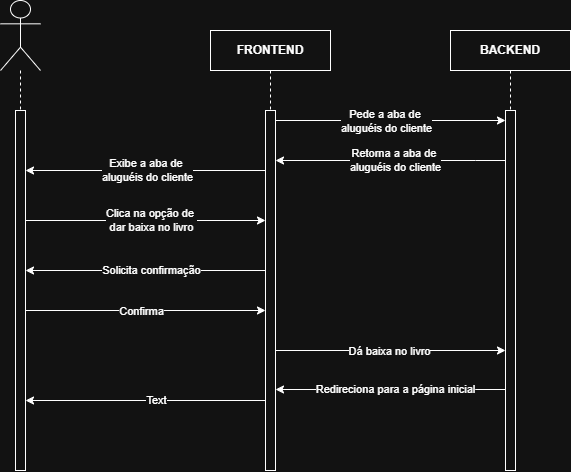
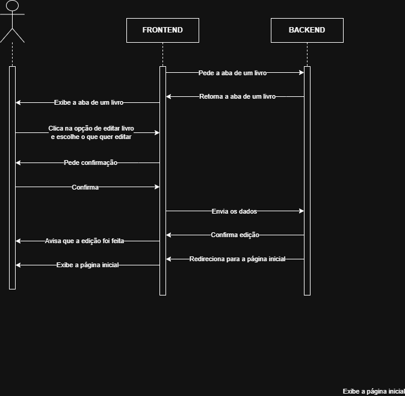
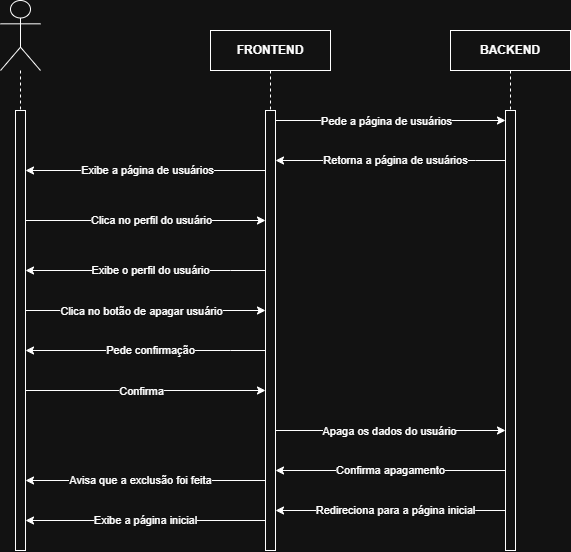
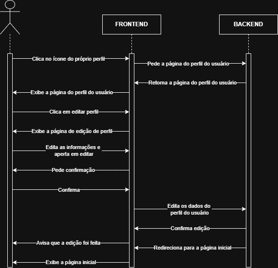
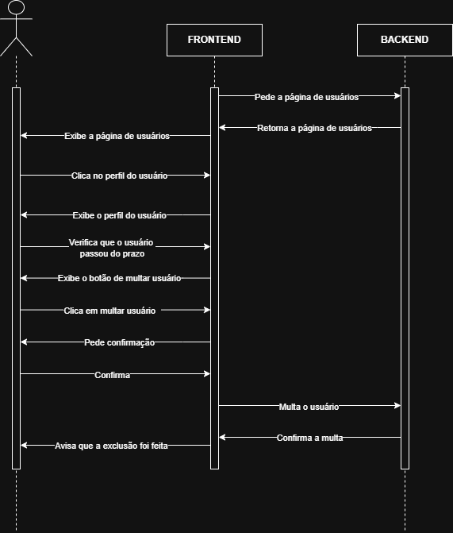

## Casos de Uso:

### Caso de uso 1: Efetuar cadastro.

#### Atores:

- Usuário.

#### Fluxo principal:

- O usuário seleciona a opção “Criar conta”.
  
- O sistema leva o usuário até a tela de registro contendo um formulário.
  
- O usuário preenche os campos do formulário (informando nome, e-mail, cpf, telefone, data de nascimento, criando uma senha e confirmando-a).
  
- O sistema consulta o banco de dados para verificar a disponibilidade das informações fornecidas.
  
- O banco de dados retorna uma confirmação positiva.
  
- O sistema realiza o cadastro, salvando os dados do novo usuário.
  
- O sistema encaminha o usuário para a página principal do site.

#### Fluxo Alternativo A: O email já está cadastrado

- O sistema apresenta formulário de cadastro.
 
- O usuário preenche os campos.

- O sistema consulta o banco de dados.

- O banco de dados retorna que o email informado já está em uso.

- O sistema exibe uma mensagem de erro informando que o email digitado já está em uso.

- O usuário digita um novo email no formulário e tenta novamente.

- O sistema registra as informações no banco de dados e informa usuário.

#### Fluxo Alternativo B: Campo vazio

- O sistema apresenta formulário de cadastro.

- O usuário não preenche um dos campos e clica no botão de "Criar Conta"

- O sistema analisa os campos de cadastro e pede que o usuário preencha todos os campos.

- O usuário preenche todos os campos  e clica no botão de "Criar Conta".

- O sistema registra as informações no banco de dados e informa usuário.

#### Fluxo Alternativo C: Senha diferente dos padrões exigidos

- O sistema apresenta formulário de cadastro.

- O usuário insere uma senha.

- O sistema analisa se a senha está dentro dos padrões exigidos  (mínimo 8 caracteres e 1 símbolo)

- O sistema exibe uma mensagem de erro e informa ao usuário que a senha está fora dos padrões.

- O sistema exibe uma mensagem sugerindo que o usuário coloque a senha correta.
  
- O sistema registra as informações no banco de dados e informa usuário.

### Caso de Uso 2: Efetuar login.

#### Atores: 

- Usuário.

#### Fluxo principal:

- O usuário seleciona a opção "Login".

- O sistema leva o usuário até a tela de preenchimento de nome, senha e email.

- O usuário preenche os campos da tela.

- O sistema consulta o banco de dados para a confirmação dos dados inseridos.

- O banco de dados retorna uma confirmação positiva.

- O sistema encaminha o usuário para a página principal do site.

#### Fluxo Alternativo A: Email inválido

- O sistema apresenta a página de formulário de Login.

- O usuário insere um email.

- O sistema consulta o banco de dados.

- O banco de dados retorna que o email informado já está em uso.

- O sistema exibe uma mensagem dizendo que o email está inválido e sugere que o usuário digite outro email.

#### Fluxo Alternativo B: Senha inválida

- O sistema apresenta a página de formulário de Login.

- O usuário insere uma senha.

- O sistema consulta o banco de dados.

- O banco de dados retorna que a senha informada está inválida.

- O sistema exibe uma mensagem dizendo que a senha está invalida e sugere que o usuário insira uma senha correta.

#### Fluxo Alternativo C: Campo vazio

- O sistema apresenta a página de formulário de Login.

- O usuário não preenche um dos campos e clica no botão de "Login".

- O sistema analisa os campos de cadastro e pede que o usuário preencha todos os campos.

- O usuário preenche todos os campos (insere email e senha)  e clica no botão de "Login".

- O sistema verifica no banco de dados se as informações estão corretas.

- O banco de dados retorna verdadeiro.

- O sistema redireciona o usuário para a página inicial do site.

### Caso de Uso 3: Buscar livros.

#### Atores: 

- Usuário.

#### Fluxo principal: 

- O sistema apresenta a página inicial do site.

- O usuário aperta na barra de pesquisa.

- O usuário digita o livro que deseja, o gênero de livro que deseja ou o autor.

- O usuário aperta no botão "Enter".

- O sistema consulta o banco de dados.

- O banco retorna os livros.

- Os livros são exibidos.

#### Fluxo Alternativo A: Campo vazio.

- O sistema apresenta a página inicial do site.

- O usuário aperta na barra de pesquisa.

- O usuário não preenche o campo e aperta a barra de pesquisa.

- O sistema analisa e pede que o usuário digite o livro que deseja, o gênero de livro que deseja ou o autor.    PAREI AQUI

- O usuário digita o livro que deseja, o gênero de livro que deseja ou o autor desejado e clica na barra de pesquisa.

- O sistema verifica no banco de dados se tem o livro que deseja, o gênero de livro que deseja ou o autor desejado.

- O banco de dados retorna verdadeiro.

- O sistema direciona o usuário para a página com o livro que deseja, o gênero de livro que deseja ou o autor desejado.

#### Fluxo Alternativo B: Livros indisponíveis.

- O sistema apresenta a página inicial do site.

- O usuário aperta na barra de pesquisa.

- O usuário digita o livro que deseja, o gênero de livro que deseja ou o autor desejado e aperta no botão "Enter".

- O sistema consulta o banco de dados.

- O banco de dados retorna negativo.

- O sistema apresenta mensagem dizendo que o livro que deseja, livros do gênero que deseja ou livros do autor desejado não tem disponíveis para aluguel no momento.

### Caso de Uso 4: Comentar.
 
#### Atores: 

- Usuário.

#### Regras de uso: O cliente pode comentar, apagar e editar o próprio comentário. O administrador pode comentar, apagar e editar o próprio comentário e apenas excluir um comentário que não é dele.

#### Fluxo principal:  

- O usuário abre a aba de um livro específico.

- O usuário aperta em um botão de comentário.

- O sistema abre uma página de comentários do tal livro.

- O usuário escreve o seu comentário.

- O usuário aperta em um botão de publicar um comentário.

- O sistema pede confimação do usuário.

- O usuário confirma a publicação.

- O sistema publica o comentário.

#### Fluxo Alternativo A: Excluir comentário.

- O usuário clica no ícone do próprio perfil.

- O sistema abre a página do perfil do usuário.

- O sistema exibe os dados de cadastro do usuário.

- O usuário clica no botão comentários.

- O sistema abre a página onde listam todos os seus comentários.

- O usuário seleciona o comentário que deseja excluir.

- O sistema abre o comentário desejado.

- O usuário clica no botão de excluir comentário.

- O sistema pede confirmação.

- O usuário confirma.

- O sistema apaga o comentário do banco de dados.

- O sistema apresenta mensagem dizendo que o comentário foi apagado.

#### Fluxo Alternativo B: Editar comentário.

- O usuário clica no ícone do próprio perfil.

- O sistema abre a página do perfil do usuário.

- O sistema exibe os dados de cadastro do usuário.

- O usuário clica no botão comentários.

- O sistema abre a página onde listam todos os seus comentários.

- O usuário seleciona o comentário que deseja editar.

- O sistema abre o comentário desejado.

- O usuário clica no botão de editar comentário.

- O usuário edita o comentário.

- O usuário clica no botão de editar.

- O sistema pede confirmação.

- O usuário confirma.

- O sistema edita o comentário do banco de dados.

- O sistema apresenta mensagem dizendo que o comentário foi editado.

### Caso de Uso 5: Efetuar aluguel do livro físico.

#### Atores: 

- Administrador.

#### Fluxo principal:  

- O administrador clica no botão de iniciar o processo de aluguel.

- O sistema abre a página de aluguel de livros.

- O administrador clica no campo de digitar o código do livro.

- O administrador preenche o código do livro a ser alugado.

- O sistema exibe os dados do livro a ser alugado.

- O sistema pede confirmação.

- O administrador confirma.

- O administrador preenche a identificação do cliente.

- O sistema pede confirmação.

- O administrador confirma.

- O sistema exibe um prazo pra devolução. 
  
- O administrador finaliza o aluguel e é redirecionado para a pagina inicial.

 #### Fluxo Alternativo A: Livro não encontrado.

- O administrador clica no botão de iniciar o processo de aluguel.

- O sistema abre a página de aluguel de livros.

- O administrador clica no campo de digitar o código do livro.

- O administrador preenche o código do livro a ser alugado.

- O sistema avisa que o livro não encontrado.

- O administrador aperta em cancelar.

- O sistema cancela.

- O sistema redireciona o administrador para a página de processo de aluguel.

 #### Fluxo Alternativo B: Livro não disponível.

- O administrador clica no botão de iniciar o processo de aluguel.

- O sistema abre a página de aluguel de livros.

- O administrador clica no campo de digitar o código do livro.

- O administrador preenche o código do livro a ser alugado.

- O sistema avisa que o livro não está disponível.

- O administrador aperta em cancelar.

- O sistema cancela.

- O sistema redireciona o administrador para a página de processo de aluguel.

### Caso de Uso 6: Finalizar aluguel do livro físico.

#### Atores: 

- Administrador.

#### Fluxo principal:  

- O administrador abre a página de aluguéis do cliente.

- O administrador clica na opção de dar baixa no livro.

- O sistema pede confirmação.

- O administrador confirma.

- O sistema volta pra página de aluguéis do cliente.

### Caso de Uso 7: Gerenciar livros.

#### Atores: 

- Administrador.

#### Fluxo principal:  

- O administrador abre a página de um livro.

- O administrador aperta no botão de editar livro.

- O administrador escolhe o que quer editar.

- O administrador edita.

- O administrador aperta no botão de editar.

- O sistema pede confirmação.

- O administrador confirma.

- O sistema avisa que a edição foi feita.

- O sistema volta pra página inicial.

#### Fluxo Alternativo A: Excluir livro.

- O administrador abre a página de um livro.

- O administrador clicar em apagar o livro.

- O sistema pede confirmação.

- O administrador confirma.

- O sistema avisa que o livro foi apagado.

- O sistema volta pra página inicial.

### Caso de Uso 8: Gerenciar usuários.

#### Atores: 

- Administrador.

#### Fluxo principal: 

- O administrador vai para a página de usuários.

- O administrador escolhe um usuário.

- O administrador clica no perfil do usuário.

- O administrador entra no perfil do usuário.

- O administrador clica no botão de apagar usuário.

- O sistema pede confirmação.

- O administrador confirma.

- O sistema apaga o usuário do banco de dados.

- O sistema avisa que o usuário foi apagado.

#### Fluxo Alternativo A: Editar usuário.

- O administrador vai para a página de usuários.

- O administrador escolhe um usuário.

- O administrador clica no perfil do usuário.

- O administrador entra no perfil do usuário.

- O administrador clica no botão de editar usuário.

- O sistema pede confirmação.

- O administrador confirma.

- O sistema edita as informações do usuário no banco de dados.

- O sistema avisa que o usuário foi editado.

### Caso de Uso 9: Gerenciar perfil.

#### Atores:

- Usuário.

#### Fluxo principal:

- O usuário clica no ícone do próprio perfil.

- O sistema abre a página do perfil do usuário.

- O sistema exibe os dados de cadastro do usuário.

- O usuário clica em editar informações do perfil.

- O usuário edita as informações do perfil.

- O usuário clica no botão de editar.

- O sistema pede confirmação.

- O usuário confirma.

- O sistema edita as informações.

- O sistema avisa que a edição foi feita.

- O sistema abre a página do perfil do usuário.

#### Fluxo Alternativo A: Cancelar edição.

- O usuário clica no ícone do próprio perfil.

- O sistema abre a página do perfil do usuário.

- O usuário clica em editar informações do perfil.
  
- O sistema exibe os dados de cadastro do usuário.

- O usuário decide que não quer mais editar e aperta o botão de cancelar edição.

- O sistema redireciona o usuário para a página do perfil do usuário. 

#### Fluxo Alternativo B: Excluir usuário.

- O usuário clica no ícone do próprio perfil.

- O sistema abre a página do perfil do usuário.

- O usuário aperta no botão de excluir conta.

- O sistema solicita a senha do usuário para proseguir com a exclusão.
  
- O usário digita a senha.
  
- O sistema analisa a veracidade da senha no banco de dados.
  
- O banco de dados retorna uma confirmação positiva.
  
- O sistema pergunta se quer confirmar a exclusão.
  
- O usuário aperta o botão confirmar.
  
- O sistema apaga os dados do usuário no banco de dados.
  
- O sistema manda uma mensagem dizendo que o usuário foi apagado.
  
- O sistema realoca o usuário para a página de login e cadastro.

#### Fluxo Alternativo C: Senha incorreta.

- O usuário acessa o menu do seu perfil com as configurações da sua conta e aperta no botão de excluir conta.

- O sistema pede que o usuário insira senha para continuar.

- O usuário insere a senha.

- O sistema verifica no banco de dados se a senha está correta.

- O banco de dados retorna negativo.

- O sistema envia uma mensagem de erro e pede que ao usuário que ele insira a senha correta.

- O usuário insere a senha correta.

- O sistema verifica no banco de dados se a senha está correta.

- O banco de dados retorna uma confirmação positiva.

- O sistema envia uma mensagem de sucesso e envia o usuário para a página de cadastro e login. 

### Caso de Uso 10: Efetuar multa.

#### Atores:

- Administrador.

#### Fluxo principal: 

- O administrador entra no perfil do usuário.

- O administrador verifica que ele passou do prazo.

- O administrador clica em multar o usuário.

- O sistema pede confirmação.

- O administrador confirma.

- O sistema multa o usuário.

- O sistema manda uma mensagem dizendo que a multa foi feita.

